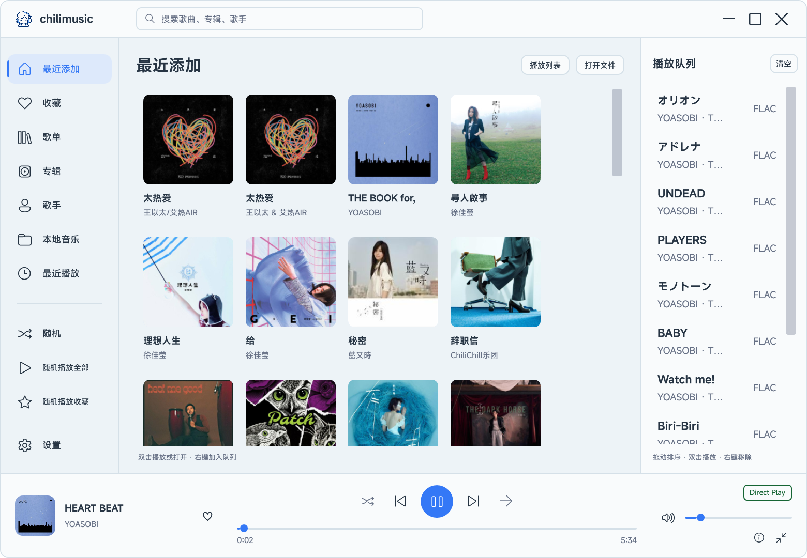
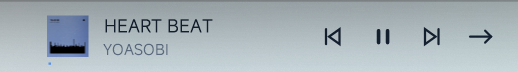

# chilimusic

Windows x64 本地音乐与 Navidrome 播放器。

## 使用

先安装 [.NET 8 Desktop Runtime x64](https://dotnet.microsoft.com/download/dotnet/8.0)，再解压便携包运行 `chilimusic.exe`，保持同目录文件完整。发布包不附带 .NET 运行时或 SDK。

- 设置中填写 Navidrome 地址和账户，保存后连接。
- 主界面点击“打开文件”，或将音乐文件拖入播放器，即可播放本地音乐。
- 任务栏小控件提供上一首、播放/暂停、下一首和播放模式切换；点击歌名打开迷你播放器，双击打开主界面。
- 托盘单击打开迷你播放器，双击打开主界面，右键提供播放、搜索、设置和退出。
- 播放器运行时 F7 播放、F8 暂停，退出后恢复键盘原功能。
- 主题支持跟随系统、浅色和深色。

设置、队列和本地曲库保存在 `%APPDATA%\chilimusic`，密码由 Windows DPAPI 加密。便携包不包含账户配置。

任务栏控件嵌入主任务栏，Explorer 重启后会重新连接。多显示器副任务栏尚未验证。

## 构建

项目为 `src/chilimusic.sln`，使用 .NET 8 SDK、WPF 和 libmpv。

1. 安装 [.NET 8 SDK](https://dotnet.microsoft.com/download/dotnet/8.0) 和 [7-Zip](https://www.7-zip.org/)。
2. 运行 `./tools/setup-native.ps1` 下载并校验固定版本的 libmpv。已有官方压缩包时可传入 `-ArchivePath`。
3. 运行 `./tools/build.ps1 -OutputDirectory ./dist` 生成不附带 .NET 运行时的便携版。

源码默认可使用系统字体。官方便携包内嵌 MiSans；需要同样字体时，从[小米官方](https://hyperos.mi.com/font/en/download/)取得 MiSans Regular、Medium、Semibold 静态字体，放到 `src/Resources/Fonts` 后编译。字体文件不单独发布到源码仓库。

`tools/convert-icon.py` 使用 Pillow，将 `design/chilimusic-icon.png` 转为应用 PNG 和多尺寸 ICO。

## 组件

播放器源码按 GPL-3.0-or-later 发布。libmpv 的来源与许可见 `licenses`；MiSans 字体仅用于应用界面，遵循小米的字体许可。图标原图在 `design`。

项目结构：`src` 为源码，`tools` 为构建和素材转换脚本，`design` 为最终图标，`docs` 为界面截图与验证记录，`licenses` 为第三方许可。`dist` 为本地构建结果，`.local` 为私有配置和构建环境，两者不上传。
